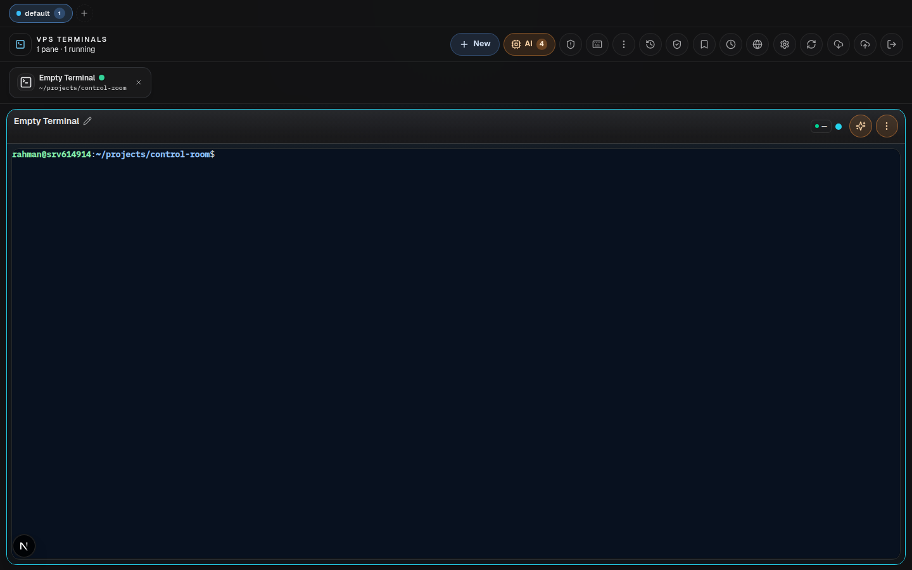
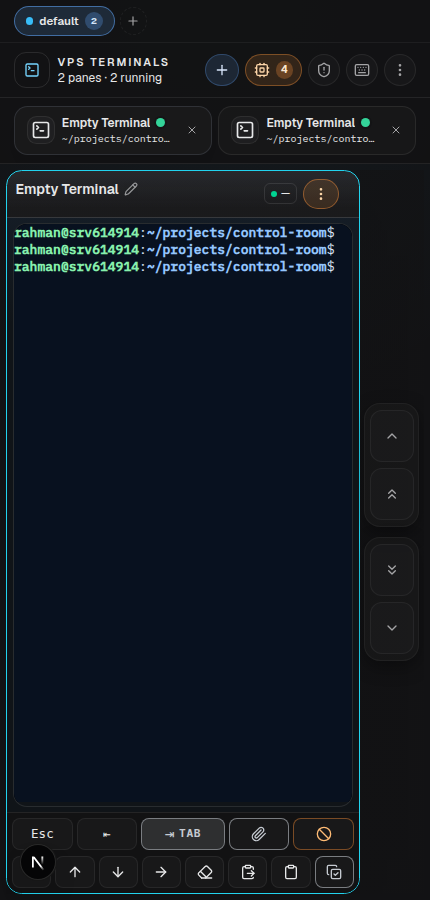
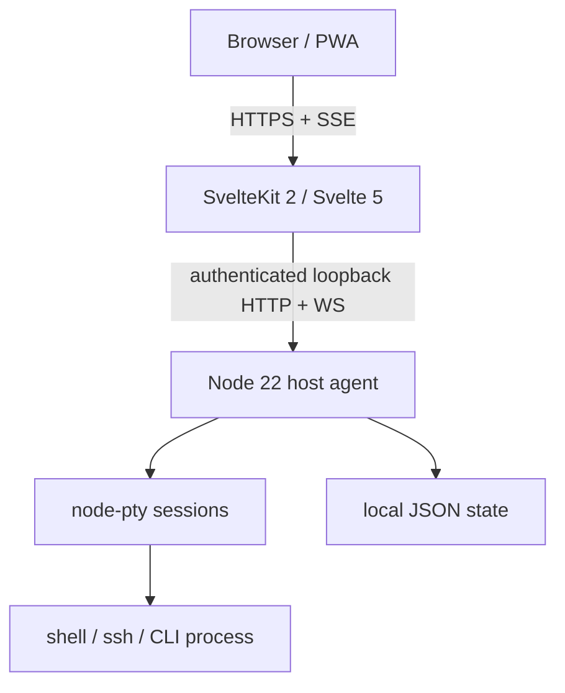

# Control Room

A browser/mobile terminal multiplexer for one machine.

Control Room is intentionally small in concept: **tmux-like terminal sessions with a web/PWA interface**. It keeps terminal processes on the host, lets you reconnect from another browser, groups panes into workspaces, and adds a few UI conveniences around the terminal. It is not a provider manager, deployment platform, credential store, browser automation engine, or general-purpose operations OS.



<p align="center">
  
</p>

## Mental model

```text
tmux                         Control Room
────────────────────────────────────────────
session       →             workspace
window/pane   →             terminal pane
attach        →             open in browser/PWA
detach        →             close browser; PTY keeps running
status line   →             topbar + connection/activity state
keyboard      →             desktop keyboard + mobile soft controls
```

The runtime flow stays simple:

```text
Browser / PWA
     │ HTTPS + SSE
     ▼
SvelteKit frontend
     │ authenticated local API
     ▼
Node host agent
     │ node-pty
     ▼
Shell / SSH / CLI process
```

An AI CLI is just another terminal process. Control Room may show a launcher, activity label, or glow for a recognized CLI, but that is a UI convenience rather than a separate AI-agent architecture.

## Core features

- Persistent PTY sessions with reconnect buffer.
- Multiple terminal panes and single/grid views.
- Workspaces for grouping terminal sessions.
- Create, rename, duplicate, move, focus, resize, and close panes.
- Broadcast input to selected panes.
- Terminal history and restore.
- Saved terminal templates.
- File/folder picker for choosing a working directory.
- Desktop and mobile/PWA layouts with safe-area handling.
- Mobile soft-key controls for terminal navigation.
- Optional CLI launch profiles; any normal shell command still works.
- Lightweight host overview for context while operating terminals.
- Signed login sessions and a loopback-only privileged agent.

## Deliberate non-goals

The following do **not** belong in Control Room core:

- provider/account credential management;
- project-specific integrations;
- browser automation engines;
- cron/job orchestration UI;
- AI supervisory orchestration;
- managed application lifecycle orchestration;
- deployment platform features unrelated to deploying Control Room itself.

If a CLI needs credentials, OAuth, browser automation, deployment logic, or its own agents, that CLI owns those concerns. Control Room only gives it a terminal.

## Architecture



Trust boundary:

- The frontend owns browser UX and authentication.
- The host agent owns PTYs and host-local operations required by the terminal UI.
- The agent binds to `127.0.0.1` by default.
- Browser JavaScript never receives the frontend→agent machine secret.
- No sibling repository or external service is required for the terminal workflow.

## Repository layout

```text
frontend/                 SvelteKit UI and authenticated server proxies
agent/                    Node 22 PTY/host agent
packages/contracts/       shared terminal contracts
packages/runtime-config/  terminal environment/profile configuration
scripts/                   deploy, install, local control, engineering helpers
.agent/                    repo-local developer memory/evidence/recipes
docs/                     install, onboarding, QA and runbook documentation
```

`.agent/` is **developer tooling**, not product functionality. It stores test/debug memory and evidence so future maintenance can reuse previous findings without making the user-facing application more complicated.

## Development

```bash
bun install --cwd frontend --frozen-lockfile
bun install --cwd agent --frozen-lockfile
bun run verify
```

`bun run verify` runs Svelte diagnostics, lint, engineering-helper tests, evidence checks, coverage gates, dependency audits, production builds, bundle-budget checks, and Playwright browser regression tests.

Focused commands:

```bash
bun run check
bun run lint
bun run test:coverage
bun run build
bun run test:e2e
```

For development workflow, risk-based isolation, memory, and evidence receipts, see [docs/engineering-workflow.md](docs/engineering-workflow.md).

## Install and deployment

- VPS installation: [docs/INSTALL.md](docs/INSTALL.md)
- Local installation: [docs/INSTALL-LOCAL.md](docs/INSTALL-LOCAL.md)
- Guided onboarding: [docs/ONBOARDING.md](docs/ONBOARDING.md)
- Operations/runbook: [docs/runbook.md](docs/runbook.md)
- Security model: [SECURITY.md](SECURITY.md)

Production deployment uses immutable frontend and agent releases with stable `current` symlinks. `scripts/deploy.sh` verifies the candidate before switching and can restore the previous pair if health verification fails.

## Configuration

Primary runtime values are documented in `.env.example`. The important security values are:

- `CONTROL_ROOM_SECRET` — human login secret.
- `CONTROL_ROOM_SESSION_SECRET` — separate HMAC session-signing key.
- `AGENT_GATEWAY_SECRET` — recommended dedicated frontend→agent machine secret.
- `AGENT_HEALTH_HOST=127.0.0.1` — keep the privileged agent loopback-bound.

Terminal-specific defaults such as shell and working directory remain optional.

## Product rule

Before adding a feature, ask:

> Does this directly improve creating, organizing, reconnecting to, or interacting with terminal sessions?

If the answer is no, it normally belongs in the CLI/tool running **inside** the terminal, not in Control Room.

## License

MIT. See [LICENSE](LICENSE).
